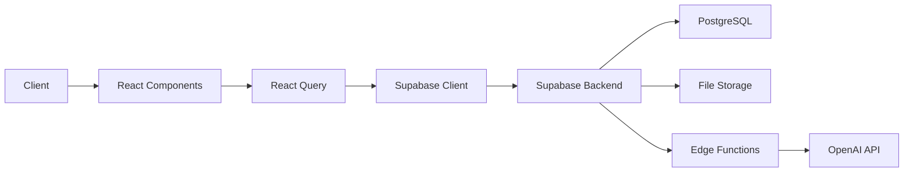

# ClassSync Nexus Hub

## 🚀 Project Overview

ClassSync Nexus Hub is an advanced educational platform that seamlessly integrates course management, collaborative learning, and AI-powered assistance. The platform leverages cutting-edge technologies to create an intuitive and efficient learning environment.

## 🏗️ Architecture Overview

### Frontend Architecture (Contributed by Prabath)
The frontend is built using a modern React-based stack with TypeScript, emphasizing type safety and component reusability.

#### Key Technologies
- **React 18** - For building a reactive and component-based UI
- **TypeScript** - Ensuring type safety and better developer experience
- **Tailwind CSS** - Utility-first CSS framework for responsive design
- **Shadcn/ui** - Accessible and customizable component library
- **Vite** - Next-generation frontend tooling for faster development
- **React Query** - For efficient server state management
- **Zustand** - Lightweight state management solution

#### Component Structure
```
src/
├── components/         # Reusable UI components
│   ├── ui/            # Base UI components
│   ├── course/        # Course-related components
│   ├── notes/         # Notes management components
│   └── dashboard/     # Dashboard components
├── pages/             # Route-based page components
├── hooks/             # Custom React hooks
├── context/           # React context providers
├── lib/              # Utility functions and helpers
└── integrations/     # Third-party service integrations
```

### Backend Architecture (Contributed by Mihisara)
The backend utilizes Supabase for robust data management and authentication.

#### Key Technologies
- **Supabase**
  - Real-time Database
  - Authentication
  - Storage
  - Edge Functions
- **PostgreSQL** - Advanced relational database
- **Row Level Security (RLS)** - For granular data access control

#### Database Schema
```sql
-- Core Tables
courses
  id uuid primary key
  title text
  description text
  subject text
  semester text
  year integer
  created_at timestamp
  creator_id uuid references auth.users

notes
  id uuid primary key
  title text
  content text
  file_url text
  course_id uuid references courses
  user_id uuid references auth.users
  is_public boolean
  created_at timestamp

user_roles
  user_id uuid references auth.users
  role text check (role in ('learner', 'contributor', 'admin'))
  created_at timestamp
```

### AI Integration Architecture (Contributed by Mihisara)
The AI system is designed for intelligent content processing and user assistance.

#### Technologies Used
- **OpenAI GPT-4** - For advanced text processing and generation
- **Supabase Edge Functions** - For serverless AI processing
- **Vector Embeddings** - For semantic search capabilities

#### AI Features
1. **Content Enhancement**
   - Automatic content summarization
   - Key points extraction
   - Study material generation

2. **Smart Search**
   - Semantic search across notes
   - Context-aware query processing
   - Personalized content recommendations

## 🛠️ Technical Implementation Details

### Authentication Flow
1. User authentication through Supabase Auth
2. Role-based access control using custom claims
3. Secure session management with JWT tokens

### Data Flow


### Security Measures
- Row Level Security (RLS) policies
- JWT-based authentication
- Secure file upload validation
- Rate limiting on API endpoints
- Environment variable encryption

## 🚀 Performance Optimizations

### Frontend
- Code splitting using React.lazy()
- Optimized asset loading
- Memoized components
- Virtual scrolling for large lists
- Service Worker for offline capabilities

### Backend
- Database indexing
- Query optimization
- Caching strategies
- Connection pooling
- Rate limiting

## 📦 Dependencies

```json
{
  "dependencies": {
    "@supabase/supabase-js": "latest",
    "react": "^18.x",
    "react-query": "^4.x",
    "tailwindcss": "^3.x",
    "typescript": "^5.x",
    "zustand": "^4.x"
  }
}
```

## 🔧 Development Setup

1. Clone the repository
```bash
git clone https://github.com/your-repo/classync-nexus-hub.git
```

2. Install dependencies
```bash
npm install
```

3. Set up environment variables
```bash
cp .env.example .env
# Configure your environment variables
```

4. Start development server
```bash
npm run dev
```

## 🌟 Key Features

1. **Course Management**
   - Dynamic course creation
   - Resource organization
   - Progress tracking

2. **Notes System**
   - Rich text editing
   - File attachments
   - Collaborative editing
   - Version control

3. **AI Assistant**
   - Smart content summarization
   - Study material generation
   - Intelligent search

4. **Analytics Dashboard**
   - Learning progress metrics
   - Engagement analytics
   - Performance insights

## 📈 Scalability Considerations

- Horizontal scaling capability
- Microservices architecture ready
- Cloud-native deployment support
- Database sharding preparation
- CDN integration for static assets

## 🤝 Contributing

Please read [CONTRIBUTING.md](CONTRIBUTING.md) for details on our code of conduct and the process for submitting pull requests.

## 📄 License

This project is licensed under the MIT License - see the [LICENSE.md](LICENSE.md) file for details.
